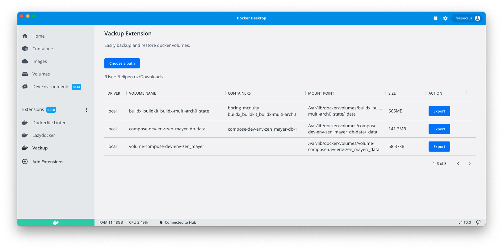

# vackup-docker-extension

This repository contains a Docker Extension that backups Docker volumes. This extension is purely a demonstration of how it'd be to convert the [Vackup](https://github.com/BretFisher/docker-vackup) project by Bret Fisher into a Docker Extension.
This example is part of the YouTube Livestream [Introducing Docker Extensions](https://www.youtube.com/watch?v=BHKp7Sc3VVc) hosted by Bret Fisher.



## Installation

Install Docker Extension with the [Extensions CLI](https://docs.docker.com/desktop/extensions-sdk/#prerequisites).

```bash
  docker extension install felipecruz/vackup-docker-extension:0.0.1
```

## Run Locally

Clone the project

```bash
  git clone https://github.com/felipecruz91/vackup-docker-extension.git
```

Go to the project directory

```bash
  cd vackup-docker-extension
```

Build the extension

```bash
  docker build -t felipecruz/vackup-docker-extension:latest .
```

Install the extension

```bash
  docker extension install felipecruz/vackup-docker-extension:latest
```

Developing the frontend

```bash
  cd ui
  npm install
  npm start
```

This starts a development server that listens on port 3000.

You can now tell Docker Desktop to use this as the frontend source. In another terminal run:

```bash
  docker extension dev ui-source felipecruz/vackup-docker-extension:latest http://localhost:3000
```

In order to open the Chrome Dev Tools for your extension when you click on the extension tab, run:

```bash
  docker extension dev debug felipecruz/vackup-docker-extension:latest
```

Each subsequent click on the extension tab will also open Chrome Dev Tools. To stop this behaviour, run:

```bash
  docker extension dev reset felipecruz/vackup-docker-extension:latest
```

## Acknowledgements

- [Vackup: Backup and Restore Docker Volumes](https://github.com/BretFisher/docker-vackup)

## License

[MIT](https://choosealicense.com/licenses/mit/)
