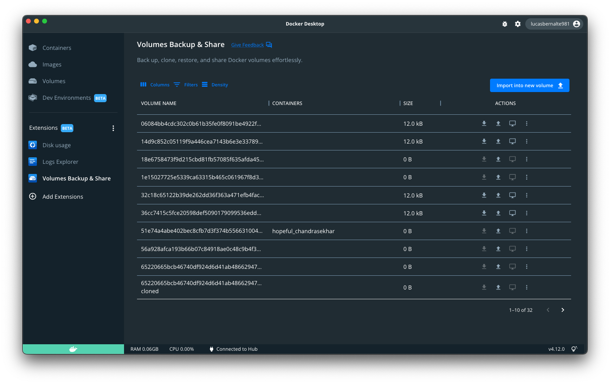

# Volumes Backup and Share Extension

[](https://github.com/docker/volumes-backup-extension/actions/workflows/build-scan-push.yaml)
[](https://github.com/docker/volumes-backup-extension/actions/workflows/hadolint.yaml)


> [!IMPORTANT]
> The functionality in this extension is now available as a Beta feature in the Volumes tab of Docker Desktop in versions 4.29.0 and above. This extension will be deprecated once the features are out of Beta. [Learn more](https://docs.docker.com/desktop/use-desktop/volumes/)




🚀 This extension was originally created by [Felipe Cruz](https://github.com/felipecruz91/)

## Features

- Export a volume:
  - To a compressed file in your local filesystem
  - To an existing local image
  - To a new local image
- To a new image in Docker Hub (or another registry)
- Import data into a new container or into an existing container:
  - From a compressed file in your local filesystem
  - From an existing image
  - From an existing image in Docker Hub (or another registry)
- Transfer a volume via SSH to another host that runs Docker Desktop or Docker engine.
- Clone a volume
- Empty a volume
- Delete a volume

## Installation

The recommended way to install the extension is from the Marketplace in Docker Desktop.
You could also install it with the Docker Extensions CLI, targeting either a published released (e.g. `1.0.0`) or branch (e.g. `main`):
```bash
  docker extension install docker/volumes-backup-extension:main
```

## Run Locally

Clone the project

```bash
  git clone https://github.com/docker/volumes-backup-extension.git
```

Go to the project directory

```bash
  cd volumes-backup-extension
```

Build the extension

```bash
  docker build -t docker/volumes-backup-extension:latest .
```

Install the extension

```bash
  docker extension install docker/volumes-backup-extension:latest
```

Developing the frontend

```bash
  cd ui
  npm install
  npm start
```

This starts a development server that listens on port 3000.

You can now tell Docker Desktop to use this as the frontend source. In another terminal run:

```bash
  docker extension dev ui-source docker/volumes-backup-extension:latest http://localhost:3000
```

In order to open the Chrome Dev Tools for your extension when you click on the extension tab, run:

```bash
  docker extension dev debug docker/volumes-backup-extension:latest
```

Each subsequent click on the extension tab will also open Chrome Dev Tools. To stop this behaviour, run:

```bash
  docker extension dev reset docker/volumes-backup-extension:latest
```

## Acknowledgements

- [Vackup project by Bret Fisher](https://github.com/BretFisher/docker-vackup)
- [Building Vackup - LiveStream on YouTube](https://www.youtube.com/watch?v=BHKp7Sc3VVc)
